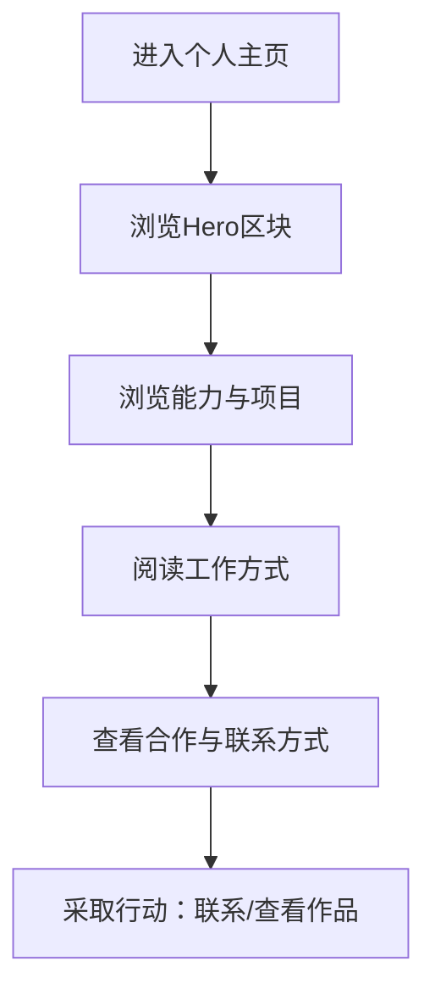

$# 产品需求文档：个人 IP 展示网站 - V0.1

## 1. 综述 (Overview)
### 1.1 项目背景与核心问题
目标是将已有个人主页 demo 复刻为可上线的个人 IP 展示网站，清晰呈现“我是谁、我能做什么、做过什么、如何合作”，以支持求职与合作转化。该 PRD 依据你提供的 demo 页面结构与内容，产出可直接指导前端实现的需求说明。

### 1.2 核心业务流程 / 用户旅程地图
1. **阶段一：建立第一印象** - 通过 Hero 区块快速传达身份与主张
2. **阶段二：能力与项目展示** - 说明技能与代表性项目/作品
3. **阶段三：工作方式** - 强化方法论与协作风格
4. **阶段四：合作与联系** - 明确合作意向与联系方式

### 1.3 Mermaid 图（流程/状态/时序）
#### 1.3.1 用户操作流（必填）


#### 1.3.2 状态机（当存在明确状态流转对象时必填）
不适用：本页面无明确状态流转对象。

#### 1.3.3 关键场景时序（仅当“时序/并发/重试/超时”影响用户可见结果时填写）
不适用：页面为静态展示，无时序交互。

## 2. 用户故事详述 (User Stories)

### 阶段一：建立第一印象

---

#### **US-01: 作为访问者，我希望在首屏快速了解个人定位与核心标签，以便判断是否值得继续浏览。**
*   **价值陈述 (Value Statement)**:
    *   **作为** 访问者/潜在合作方
    *   **我希望** 在首屏看到清晰的身份定位、主张与标签
    *   **以便于** 快速形成对个人能力与方向的判断
*   **业务规则与逻辑 (Business Logic)**:
    1. **前置条件**: 用户打开主页。
    2. **操作流程 (Happy Path)**:
        1. 首屏左侧展示头像、主标题、主张、副标签、标签组、背景简介。
        2. 头像为可替换图片（占位图可用）。
        3. 标签组为多枚短标签（如“工程思维/用户增长/AI 产品构建”等）。
    3. **异常处理 (Error Handling)**:
        * 若头像未加载，显示默认占位图与“上传头像”提示。
        * 若标签超出一行，自动换行但保持间距一致。
*   **验收标准 (Acceptance Criteria)**:
    * **场景1: 首屏展示**
        * **GIVEN** 用户首次进入页面
        * **WHEN** 页面加载完成
        * **THEN** 看到头像、主标题“独立开发者”、主张“用 AI 把想法做成产品”、标签组与背景简介。
    * **场景2: 头像缺失**
        * **GIVEN** 头像资源不可用
        * **WHEN** 页面渲染
        * **THEN** 显示默认占位图且布局不塌陷。

---
*   **页面布局线框图 (ASCII Wireframe)**:
```text
+--------------------------------------------------------------+
|                          Hero区块                            |
+----------------------------+---------------------------------+
| [头像占位图]               | 右侧内容区（下一故事）           |
| 独立开发者                 |                                 |
| 用 AI 把想法做成产品        |                                 |
| [工程思维] [用户增长] ...   |                                 |
| 工科背景 & 广告学训练       |                                 |
+----------------------------+---------------------------------+
```

### 阶段二：能力与项目展示

---

#### **US-02: 作为访问者，我希望看到清晰的能力概览与代表项目，以便评估合作或雇佣价值。**
*   **价值陈述 (Value Statement)**:
    *   **作为** 访问者/招聘方
    *   **我希望** 看到能力卡片与项目分类
    *   **以便于** 快速判断能做什么、做过什么
*   **业务规则与逻辑 (Business Logic)**:
    1. **前置条件**: Hero 区块加载完成。
    2. **操作流程 (Happy Path)**:
        1. 展示“我能做什么”技能卡片（独立开发/增长策略/AI 视频）。
        2. 展示“我的项目”分组（产品开发、AI 视频创作）。
        3. 项目卡片包含标题、状态 badge、简短描述与可选链接。
    3. **异常处理 (Error Handling)**:
        * 若项目无链接，不显示链接按钮。
        * 若项目状态为空，隐藏 badge 区域。
*   **验收标准 (Acceptance Criteria)**:
    * **场景1: 技能与项目展示**
        * **GIVEN** 页面渲染完成
        * **WHEN** 用户向下浏览
        * **THEN** 看到技能卡片与项目分组，结构清晰。
    * **场景2: 无链接项目**
        * **GIVEN** 某项目未配置链接
        * **WHEN** 页面渲染
        * **THEN** 不显示“查看/访问”链接。

---
*   **页面布局线框图 (ASCII Wireframe)**:
```text
+--------------------------------------------------------------+
| 我能做什么                                                    |
| [独立开发] [增长策略] [AI 视频]                               |
+--------------------------------------------------------------+
| 我的项目                                                      |
| 产品开发                                                      |
|  - 策划方案生成器 [已上线]  描述...  [查看 →]                  |
|  - 增长策划官 Agent [Demo]  描述...                           |
|  - 开发中项目 [开发中]    描述...                             |
| AI 视频创作                                                   |
|  - AI 动漫短剧 [Demo]   [视频预览]                             |
|  - AI 短视频 [Demo x2] [视频预览]                             |
+--------------------------------------------------------------+
```

### 阶段三：工作方式

---

#### **US-03: 作为访问者，我希望了解工作方式与协作风格，以便判断合作匹配度。**
*   **价值陈述 (Value Statement)**:
    * **作为** 潜在合作方
    * **我希望** 看到方法论与工作特点
    * **以便于** 评估与我的需求是否匹配
*   **业务规则与逻辑 (Business Logic)**:
    1. **前置条件**: 能力与项目区块已展示。
    2. **操作流程 (Happy Path)**:
        1. 展示三张方法论卡片（Vibe Coding/从需求出发/独立闭环）。
        2. 每张卡片包含标题与一句话描述。
    3. **异常处理 (Error Handling)**:
        * 若描述过长，最多两行显示并保持对齐。
*   **验收标准 (Acceptance Criteria)**:
    * **场景1: 方法论展示**
        * **GIVEN** 用户滚动到方法论区域
        * **WHEN** 页面渲染
        * **THEN** 显示 3 张卡片且排版对齐。

---
*   **页面布局线框图 (ASCII Wireframe)**:
```text
+--------------------------------------------------------------+
| 我的工作方式                                                  |
| [Vibe Coding]      [从需求出发]      [独立闭环]               |
| 描述...             描述...             描述...               |
+--------------------------------------------------------------+
```

### 阶段四：合作与联系

---

#### **US-04: 作为访问者，我希望清楚知道合作方式与联系方式，以便采取下一步行动。**
*   **价值陈述 (Value Statement)**:
    * **作为** 潜在雇主/客户
    * **我希望** 看到合作方向与联系入口
    * **以便于** 直接联系或获取作品集
*   **业务规则与逻辑 (Business Logic)**:
    1. **前置条件**: 页面内容已完整展示。
    2. **操作流程 (Happy Path)**:
        1. 左列展示“如果你在招”与对应岗位/需求列表。
        2. 右列展示“如果你需要”与合作类型列表。
        3. 提供两条 CTA（简历/作品集、联系我）。
        4. 底部显示社交账号与短句提示。
    3. **异常处理 (Error Handling)**:
        * 邮箱未配置时隐藏“联系我”按钮或显示占位。
        * 外链为空时不跳转。
*   **验收标准 (Acceptance Criteria)**:
    * **场景1: CTA 可见**
        * **GIVEN** 页面底部渲染完成
        * **WHEN** 用户滚动至联系区
        * **THEN** 看到双列内容与 2 个 CTA 按钮。
    * **场景2: 邮箱缺失**
        * **GIVEN** 未配置邮箱
        * **WHEN** 页面渲染
        * **THEN** “联系我”按钮隐藏或置灰不可点击。

---
*   **页面布局线框图 (ASCII Wireframe)**:
```text
+--------------------------------------------------------------+
| 合作与联系                                                    |
+----------------------------+---------------------------------+
| 如果你在招                 | 如果你需要                      |
| - 独立开发者/AI产品工程师   | - 小型AI产品独立开发             |
| - 能独立出Demo的产品角色    | - 营销类产品快速原型             |
| [简历/作品集 →]             | - AI短剧/AI视频内容合作          |
|                             | [联系我 →]                       |
+----------------------------+---------------------------------+
| Twitter: @yourhandle                                        |
| 看我还能做出什么                                             |
+--------------------------------------------------------------+
```

## 3. MVP 功能范围
- 单页个人 IP 展示网站（静态结构）
- 四个核心区块：Hero / 项目与能力 / 方法论 / 合作联系
- 支持内容替换（头像、标签、项目、联系方式）

## 4. 非目标 (Out of Scope)
- 登录/评论/表单提交等交互功能
- 动态数据源或后台管理系统
- 自动生成内容或 AI 生成模块

## 5. 关键指标 (Success Metrics)
- 访问者在 10 秒内获得清晰定位与能力认知
- 访问者可在页面内完成“联系/查看作品”的下一步操作
- 页面结构与 demo 保持高度一致，可直接复刻

## 6. 风险与假设
- 假设主要访问场景为桌面端，移动端需额外适配。
- 若内容信息不完整（头像/链接/邮箱），需提供默认占位策略。

## 7. 交付物
- 完整前端页面结构与样式（复刻 demo）
- 可替换的内容配置（头像/项目/联系方式）
